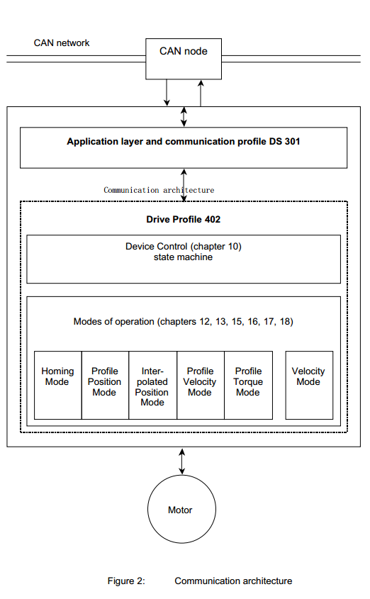

- [5. 工作原理](#5-工作原理)
    - [5.1. 引言/介绍](#51-引言介绍)
    - [5.2. 通过分析进行标准化](#52-通过分析进行标准化)
    - [5.3. 对象字典](#53-对象字典)
        - [5.3.1. 索引和子索引的使用](#531-索引和子索引的使用)

---

## 5. 工作原理  
>OPERATING PRINCIPLE

### 	5.1. 引言/介绍 
>Introduction 

此配置文件的目的是为CAN网络上的驱动器提供可理解且独特的行为。 用于驱动器和运动控制的CANopen设备配置文件建立在称为CANopen的CAN通信配置文件之上，描述了CAN网络中所有设备通用的基本通信机制。
>The purpose of this profile is, to give drives an understandable and unique behavior on the CANnetwork. The CANopen Device Profile for Drives and Motion Control is built on top of a CANcommunication profile, called CANopen, describing the basic communication mechanisms common toall devices at the CAN-network.

驱动单元的目的是将轴控制器或其他运动控制产品连接到CAN总线。 它们可以接收通常用于I/O配置的服务数据对象所做的配置信息，限制扩展参数或应用程序的特定参数。 在运行时，可以通过轮询或事件驱动（中断）通过CAN总线从驱动单元获取数据。
>The purpose of drive units is to connect axle controllers or other motion control products to the CAN bus. They can receive configuration information what is done via service data objects normally for I/O configurations, limit parameters for scaling or application specific parameters. At run time, data can be obtained from the drive unit via CAN bus by either polling or event driven (interrupt).

运动控制产品具有用于实时操作的过程数据对象映射(PDO)，其可以使用服务数据对象(SDO)来配置（参见/3/）。 该通信信道用于交换实时数据，如设定点或实际值，如位置实际值
>The motion control products have a process data object mapping for real time operation, which may be configured using service data objects (see /3/). This communication channel is used to interchange real-time data like set-points or actual values like a position actual value e.g.

### 	5.2. 通过分析进行标准化 
>Standardization via profiling. 
	
设备规范的配置文件方法的两个主要优点在于系统集成和设备标准化。
>The two principal advantages of the profile approach for device specification are in the areas of system integration and device standardization. 

如果两个独立设备制造商设计必须通信的产品，则必须为两个制造商提供另一个制造商的设备规范（来使两个产品兼容）。 这些规范在正式和术语方面将因公司而异。 设备配置文件的概念提供了生成此类规范的标准。 通过采用这种方法，所有制造商都将以类似的方式指定他们的设备，这大大减少了系统集成的工作量。
>If two independent device manufacturers design products that have to communicate, then both manufacturers must be provided with a device specification from the other one. These specifications will widely differ in formal and terminological aspects from one company to another. The concept of device profiling provides a standard for producing such specifications. By adopting this approach, all manufacturers will specify their devices in a similar fashion, what greatly reduces the effort involved in system integration.

用于设备规范的配置文件的方法的另一明显的优点是，它可以用于指导制造商生产标准化设备。 标准化设备的优点很多。 最重要的是，标准化设备将系统集成商与特定供应商分离。 如果一个供应商无法满足特殊的应用需求，系统设计人员可以轻松地使用其他供应商提供的设备。 另一方面，设备制造商不再被迫为每个客户实施私有协议。
>The other obvious advantage of the profile approach for device specification is, that it can be used to guide manufacturers into producing standardized devices. The advantages of standardized devices are numerous. Perhaps most important is the idea, that a standardized device decouples a system integrator from a specific supplier. If one supplier cannot meet special application demands, a system designer can use devices from another supplier with reduced effort. On the other hand the device manufacturers are not forced any more to implement private protocols for each customer.

设备配置文件定义了“标准”设备。 此标准设备代表真正的基本功能，此设备类中的每个设备都必须支持。 这种强制性功能对于确保至少简单的非制造商特定的设备操作是必要的。 例如，标准驱动单元提供“快速停止”功能来停止驱动器。 此功能被定义为必需功能，因此可以使用相同的消息暂停支持驱动器和运动控制的CANopen设备配置文件的任何驱动器单元。
>A device profile defines a ‘standard’ device. This standard device represents really basic functionality, every device within this device class must support. This mandatory functionality is necessary to ensure, that at least simple non-manufacturer-specific operation of a device is possible. For example the standard drive unit provides a 'Quick stop' function to stop a drive. This function is defined as mandatory, such that any drive unit supporting the CANopen Device Profile for Drives and Motion Control, can be halted using the same message. 

设备标准化的概念通过标准化设备配置文件中定义的可选功能的概念进行扩展。 所有制造商都不必必须实现这种可选功能。 但是，如果制造商实施这种功能，他必须以固定的方式这样做。
>The concept of device standardization is extended by the notion of optional functionality defined within the standardized device profile. Such optional functionality does not have to be implemented by all manufacturers. However, if a manufacturer implements such functionality he must do so in a fixed manner.

提供可选功能是一种非常强大的机制，可确保所有制造商以定义的方式实现特定功能。 例如，设备配置文件也包括多轴模块，这仍然不是很常见。 通过定义对不同轴的标准化访问，来自不同制造商的交换设备变得更容易。
>Providing optional functionality is a very powerful mechanism to ensure all manufacturers implementing particular functionality in a defined fashion. For example, the device profile covers multiaxles modules as well, which are still not very common. By defining a standardized access to the different axles, interchanging devices from different manufacturers becomes easier. 

设备配置文件提供了一种机制，希望实现真正的制造商特定功能的制造商也可以这样做。 这显然是必要的，因为无法预测所有可能的设备功能并在每个设备类的可选类别中定义它。 这一概念保证了标准设备配置文件“面向未来”。
>The device profiles provide a mechanism by which manufacturers wishing to implement truly manufacturer specific functionality can do so as well. This is clearly necessary since it would be impossible to anticipate all possible device functionality and define this in the optional category of each device class. This concept guarantees that the standard device profiles are 'future-proof'. 

通过定义强制设备特性，可以保证基本的网络操作。 通过定义可选的设备功能，可以内置一定程度的灵活性。通过为制造商特定的功能留下“钩子”，制造商将不会受限于过时的标准。
>By defining mandatory device characteristics, basic network operation is guaranteed. By defining optional device features a degree of defined flexibility can be built in. By leaving 'hooks' for manufacturer specific functionality, manufacturers will not be constrained to an out-of-date standard.

### 	5.3. 对象字典 
>The object dictionary 

设备配置文件中最重要的部分是对象字典描述。 对象字典本质上是通过网络以有序的预定义方式访问的对象的分组。 使用16位索引对字典中的每个对象进行寻址，对象字典最多包含65536个条目。
>The most important part of a device profile is the object dictionary description. The object dictionary is essentially a grouping of objects accessible via the network in an ordered pre-defined fashion. Each object within the dictionary is addressed using a 16-bit index so that the object dictionary may contain a maximum of 65536 entries.

这个的布局与其他现场总线系统的设备配置文件是紧密一致的，详见/3/。
>The layout closely conforms with device profiles for other field bus systems and is described in detail in /3/. 

索引6000h到9fffh处的标准化设备配置文件区域包含一类设备共同的所有数据对象，这些设备可以通过网络读取或写入。驱动器配置文件使用从6000h到9fffh的条目描述驱动器参数和驱动器功能。在这个范围内，最多可以实现8个轴。此外，还可以描述与驱动器组合的可选I/O模块。这些I/O模块必须符合DS 401（见/4/）的要求，并且可以代替轴来实现。对于标准驱动器，必须在6000h到67ffh之间切换。索引060h到0fffh和A000h到ffff还有两个保留区，供通信或驱动器配置文件将来使用。
>The standardized device profile area at indices 6000h through 9FFFh contains all data objects common to a class of devices that can be read or written via the network. The drives profile uses entries from 6000h to 9FFFh to describe the drive parameters and the drive functionality. Within this range up to 8 axles can be realized. Additional it is possible to describe optional I/O modules combined with the drive. These I/O modules must conform to DS 401 (see /4/) and can be implemented instead of an axle. For standard drives only the range 6000h to 67FFh  is mandatory. There are also two reserved areas at indices 060h through 0FFFh and A000h through FFFFh for future use by the communication or drive profile. 
	
####		5.3.1. 索引和子索引的使用 
>Index and sub-index usage 

---

***Communication architecture***

  

图2.通讯体系结构
>Figure 2: Communication architecture

---
